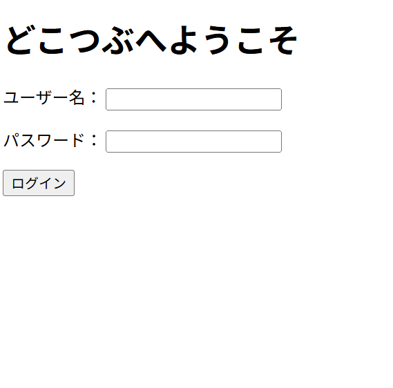
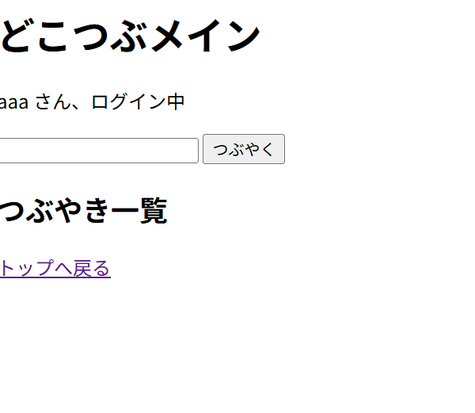
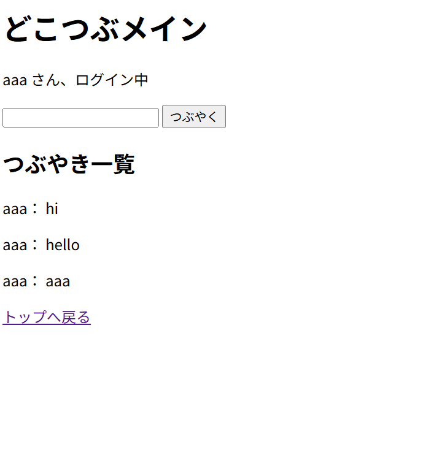

# dokotsubu-app-python
# どこつぶアプリ（Python版）

# dokotsubu-app-python

## 📝 アプリ概要
Python（Flask）で作成した簡易SNSアプリです。  
ログイン機能、投稿機能、一覧表示機能を実装しています。

---

## 💡 制作背景
医療事務として電子カルテ導入に関わる中でITに興味を持ち、  
業務効率化や現場改善に貢献できるシステムを作りたいと考え、本アプリを制作しました。

---

## ⚙️ 使用技術
- Python
- Flask
- HTML

---

## 🖥️ 画面イメージ

### 🔑 ログイン画面

---

### 🏠 メイン画面

---

### ❌ ログイン失敗画面

---

## 🚀 工夫した点
- ログイン状態の管理
- 投稿内容の一覧表示機能
- シンプルで分かりやすいUI設計

---

## 📌 今後の改善
- データベース連携
- ユーザー登録機能
- デザイン改善

---
