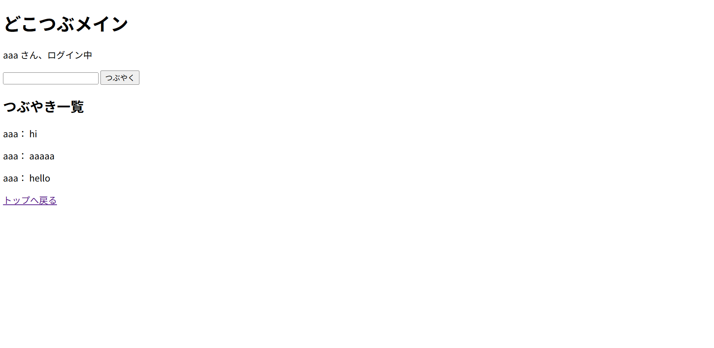

# dokotsubu-app-python
# どこつぶアプリ（Python版）

## 概要
Python（Flask）を使用して作成した簡易SNSアプリです。  
ログイン機能、投稿機能、一覧表示機能を実装しています。

医療事務として電子カルテ導入に関わる中でITに興味を持ち、  
学習のアウトプットとして作成しました。  
また、Java（Servlet/JSP）で作成したアプリを、Python（Flask）でも再実装しました。

## 使用技術
- Python
- Flask
- HTML

## 機能
- ログイン機能
- 投稿機能
- 投稿一覧表示
- ログアウト機能

## 画面イメージ

### ログイン画面

### メイン画面（投稿前）

### メイン画面（投稿後）

## 作成背景
電子カルテ導入に関わる中で、システムや業務改善に興味を持ったことをきっかけに学習を始めました。  
本アプリは、学習内容の理解を深めるために作成したものです。

## 今後
- ユーザー登録機能の追加
- デザインの改善
- バリデーションの追加
